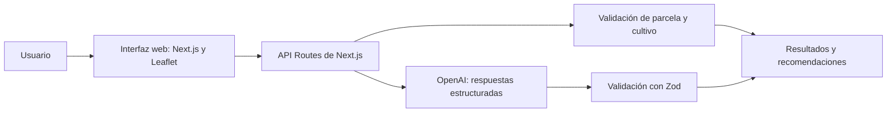

<div align="center">

# AgroSim Manabí

**Simulación agrícola y apoyo a decisiones para parcelas de Manabí, Ecuador.**

[](https://nextjs.org/) [](https://www.typescriptlang.org/) [](https://openai.com/) [](https://zod.dev/)

[🌐 Ver demo](https://agro-sim-manabi.vercel.app)

</div>

> 🥈 **Segundo lugar en OpenAI Build Week Portoviejo.** Proyecto desarrollado en equipo.

## Sobre el proyecto

AgroSim es una aplicación web que permite delimitar parcelas en un mapa, explorar escenarios de riego y clima, y obtener orientación agrícola contextualizada para Manabí. Las respuestas de IA se estructuran y validan antes de mostrarse.

## Funcionalidades

- Delimitar parcelas sobre un mapa interactivo con Leaflet.
- Validar el cultivo seleccionado y comprobar si la parcela está dentro del área admitida para el análisis.
- Generar simulaciones y recomendaciones agrícolas contextualizadas para Manabí.
- Analizar fotografías y observaciones del usuario para devolver hallazgos y acciones sugeridas.
- Validar las respuestas estructuradas con esquemas Zod.

## Arquitectura



## Tecnologías

| Área | Tecnologías |
| --- | --- |
| Aplicación web | Next.js 14, React 18, TypeScript |
| Interfaz y mapas | Tailwind CSS, Leaflet, React Leaflet |
| IA y validación | OpenAI API, Structured Outputs, Zod |

## Ejecutar localmente

### Requisitos

- Node.js y npm
- Una clave de API de OpenAI

### Pasos

```bash
git clone https://github.com/SrChaoz/AgroSim-Manabi.git
cd AgroSim-Manabi
npm install
cp .env.example .env.local
```

Añade tu clave a `.env.local`:

```env
OPENAI_API_KEY=tu_clave_de_openai
```

Inicia el servidor de desarrollo:

```bash
npm run dev
```

Abre [http://localhost:3000](http://localhost:3000) en el navegador.

## API principal

| Ruta | Propósito |
| --- | --- |
| `POST /api/validate-crop` | Valida y normaliza el cultivo ingresado. |
| `POST /api/simulate` | Valida la parcela y genera una simulación agrícola estructurada. |
| `POST /api/diagnose` | Analiza una imagen y observaciones para proponer hallazgos y acciones. |

## Uso responsable

AgroSim es un prototipo de apoyo a la decisión. Sus simulaciones y análisis no sustituyen la evaluación en campo ni el criterio de un profesional agrónomo.
